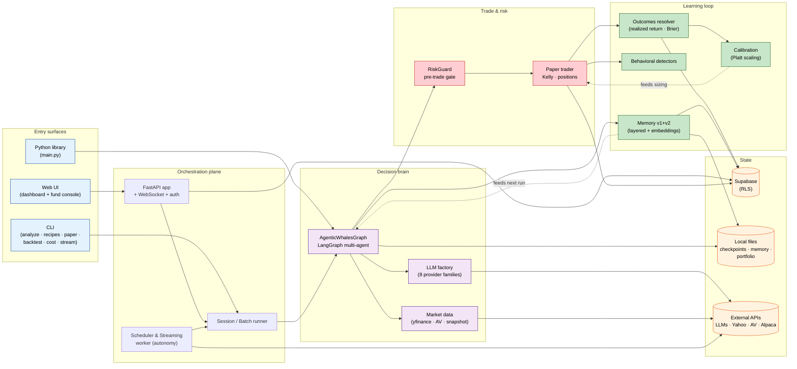
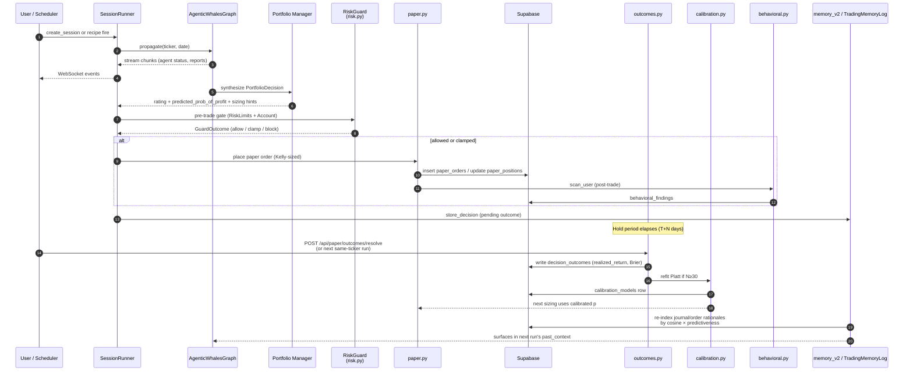

# AgenticWhales — Architecture

AgenticWhales is a multi-agent financial-intelligence platform. A LangGraph
pipeline orchestrates specialized LLM agents (analysts → researchers → trader
→ risk debate → portfolio manager) over market data, and the resulting trade
proposals flow through risk gates into a paper-trading book whose outcomes
feed calibration, behavioral, and memory subsystems back into future runs.

Three entry surfaces share the same `AgenticWhalesGraph` core:

- **CLI** (`cli/main.py`, Typer) — interactive single-instrument runs + Phase 1
  sub-commands (`recipe`, `paper`, `cost`, `backtest`, `stream`).
- **Web UI** (`web/server.py`, FastAPI + WebSocket + Supabase) — research
  dashboard at `/` and Phase 1 Fund workspace at `/fund` with baskets,
  recipes, paper trading, risk controls.
- **Python API** (`main.py` example) — direct `AgenticWhalesGraph(...).propagate(ticker, date)`.

---

## 0. Bird's-eye view

A high-altitude map of how a request becomes a trade and a lesson. Every box
below is detailed further in §1.

**Persona × Surface × Tier.** AgenticWhales is one decision engine behind
three deliberate surfaces — keeping them distinct is the strategy, not an
accident.

| Persona            | Primary surface       | Secondary surface | Tier driver         |
|--------------------|-----------------------|-------------------|---------------------|
| Quant researcher   | Python lib (`main.py`) | CLI               | Free / Pro          |
| Power trader       | CLI (`agenticwhales`) | Web `/`           | Pro                 |
| Fund manager       | Web `/fund` (autonomy)| —                 | Fund                |

The CLI exists because terminal-native quants will never adopt a browser
flow; the Python lib exists because researchers need scriptable access; the
Web UI exists because fund managers want a dashboard. Collapsing to one
surface kills two audiences. Tiering is enforced server-side via
`cost_middleware` + (planned) `entitlements.py` reading `profiles.tier`.

**Scope today.** US equities (yfinance + Alpha Vantage) and US crypto
(Alpaca). Single-currency `paper_accounts`. `exchange_calendars` is in
scope but every active calendar resolves to NYSE. Multi-market support is
explicitly deferred until a second-market PMF signal — see
[architecture-review.md](architecture-review.md) item S4.



---

## 1. System-level architecture

```mermaid
flowchart TB
    subgraph Users["Users / Clients"]
        BROWSER["Browser<br/>(index.html / fund.html)"]
        CLI_USER["Terminal user<br/>(agenticwhales CLI)"]
        PYAPI["Python script<br/>(main.py / library use)"]
    end

    subgraph Frontend["Frontend (web/static/)"]
        APPJS["app.js<br/>research dashboard"]
        FUNDJS["fund.js<br/>fund / autonomy console"]
        SBJS["supabase-client.js<br/>auth + RLS calls"]
        STATIC_CSS["styles.css · fund.css ·<br/>favicon.svg"]
    end

    subgraph WebSrv["FastAPI App (web/server.py + __main__.py)"]
        ROUTES["REST routes<br/>/api/sessions, /api/batches,<br/>/api/recipes, /api/paper/*,<br/>/api/risk/*, /api/journal/*,<br/>/api/calibration, /api/behavioral/*,<br/>/api/memory/search, /api/disagreement,<br/>/api/conviction/*, /api/audit/*,<br/>/healthz /readyz /metrics"]
        WSROUTES["WebSocket routes<br/>/api/sessions/{sid}/stream<br/>/api/batches/{bid}/stream<br/>/api/stream/quotes"]
        LIFESPAN["lifespan()<br/>boots scheduler<br/>+ streaming worker"]
    end

    subgraph WebRuntime["Web Runtime (web/)"]
        SR["SessionRunner<br/>(runner.py)"]
        BR["BatchRunner<br/>(batch_runner.py)"]
        SCHED["RecipeScheduler<br/>(scheduler.py)<br/>APScheduler + PG advisory lock"]
        STREAMW["StreamingWorker<br/>(streaming_worker.py)<br/>Alpaca → trigger eval"]
        WAUTH["auth.py<br/>JWT + RLS + service-role CRUD"]
        WSTORE["storage.py / batch_storage.py"]
    end

    subgraph CLISurface["CLI (cli/)"]
        CLIMAIN["main.py — analyze loop<br/>(Rich live layout)"]
        CLIRECIPE["recipes.py"]
        CLIPAPER["paper.py"]
        CLICOST["cost.py"]
        CLIBACK["backtest.py"]
        CLISTRM["stream.py"]
        CLISTATS["stats_handler.py<br/>LangChain callback"]
        CLIUTIL["config.py · models.py ·<br/>utils.py · announcements.py"]
    end

    subgraph Core["Core Graph (agenticwhales/graph/)"]
        TG["AgenticWhalesGraph<br/>trading_graph.py"]
        GSETUP["GraphSetup<br/>setup.py<br/><b>Heterogeneity Mandate ⚑</b><br/>(synthesizers ≠ debaters,<br/>fail-fast at __init__)"]
        COND["ConditionalLogic"]
        PROP["Propagator"]
        REFL["Reflector"]
        SIG["SignalProcessor<br/>(structured rating preferred,<br/>regex is fallback)"]
        CKPT["Checkpointer<br/>SqliteSaver per-ticker"]
        HET["heterogeneity.py<br/>config invariant check"]
    end

    subgraph Agents["Agents (agenticwhales/agents/)"]
        ANALYSTS["Analysts<br/>market · quant · social ·<br/>news · fundamentals"]
        RESEARCH["Researchers<br/>Bull · Bear · Research Manager"]
        TRADER["Trader"]
        RISK["Risk Debate<br/>Aggressive · Neutral · Conservative"]
        PM["Portfolio Manager"]
        SCHEMAS["schemas.py<br/>ResearchPlan · TraderProposal ·<br/>PortfolioDecision · QuantRadar ·<br/>GuardOutcome · ImpersonationToken"]
        STRUCT["structured.py<br/>bind_structured + fallback"]
        ATOOLS["agents/utils tools<br/>core_stock · technical_indicators ·<br/>fundamental_data · news_data ·<br/>rating · agent_utils · agent_states"]
    end

    subgraph LLMs["LLM Clients (agenticwhales/llm_clients/)"]
        FACTORY["factory.py<br/>create_llm_client"]
        BASEC["base_client.py"]
        OAI["openai_client"]
        ANT["anthropic_client"]
        GOO["google_client"]
        AZ["azure_client"]
        MODELCAT["model_catalog.py"]
        COSTMW["cost_middleware.py<br/>BudgetExceeded gate"]
        PRICE["pricing.py"]
        VAL["validators.py"]
    end

    subgraph Data["Dataflows (agenticwhales/dataflows/) — scope: US equities + crypto"]
        DFIFACE["interface.py<br/>unified accessor"]
        YF["y_finance.py / yfinance_news.py"]
        AV["alpha_vantage_*.py<br/>stock · indicator ·<br/>fundamentals · news"]
        SS["stockstats_utils.py"]
        DFUTIL["dataflows/utils.py · config.py"]
        SNAP["market_snapshot.py<br/>authoritative latest-close"]
        CAL["calendar.py<br/>exchange_calendars"]
        ASOF["asof.py<br/>look-ahead guard"]
        UNI["universe.py"]
    end

    subgraph Decisioning["Decision & Trading"]
        PAPER["paper.py<br/>Kelly sizing + order placement"]
        RISKGUARD["risk.py<br/>RiskGuard pre-trade gate"]
        PORTFOLIO["portfolio.py<br/>positions store"]
        OUTCOMES["outcomes.py<br/>resolve realized return → Brier"]
        BACKTEST["backtest.py<br/>replay harness"]
        CLASSICAL["classical.py<br/>rules-based analyst"]
        DAG["dag.py<br/>multi-timeframe fan-out"]
        CONVD["conviction_decay.py<br/>time/regime-aware decay"]
        STRM["streaming.py<br/>Alpaca client wrapper"]
    end

    subgraph Memory["Memory & Learning"]
        MEMLOG["agents/utils/memory.py<br/>TradingMemoryLog<br/>(layered FinMem-style)"]
        MEMV2["memory_v2.py<br/>embedding retrieval<br/>cosine × predictiveness"]
        CALIB["calibration.py<br/>per-user Platt scaling"]
        ADAPT["adaptive.py<br/>quick→deep escalation<br/>+ prompt-eval harness"]
        BEHAV["behavioral.py<br/>tilt · revenge · anchoring ·<br/>overconfidence detectors"]
        DISAGR["disagreement.py<br/>Bull/Bear cosine + agreement"]
        ABLATE["ablation.py<br/>analyst contribution scoring"]
        ASK["ask.py<br/>10 templated retrospectives"]
    end

    subgraph Autonomy["Autonomy & Triggers"]
        RECIPES["recipes.py<br/>scheduled debate runs"]
        TRIGGERS["triggers.py<br/>price/volume/news/cross/time"]
    end

    subgraph Obs["Observability"]
        OBS["observability.py<br/>structlog + Prometheus"]
        AUDIT["audit.py<br/>append-only audit_log"]
        METRICSEP["/metrics endpoint<br/>(token-gated)"]
    end

    subgraph Quality["Test & Tooling"]
        TESTS["tests/<br/>40+ unit tests + tests/integ/"]
        SCRIPTS["scripts/<br/>alpaca_smoke · seed_demo_users ·<br/>smoke_structured_output"]
        PROBES["tools/<br/>probe_tau_* DeepSeek harnesses"]
    end

    subgraph Persist["Persistence"]
        SUPA[("Supabase Postgres<br/>(RLS-enforced)")]
        MEMFB[("In-memory fallback<br/>web/auth._memstore")]
        FILES[("Local files<br/>~/.tradingagents/memory/<br/>~/.tradingagents/cache/checkpoints/<br/>~/.agenticwhales/portfolio.json<br/>results_dir/")]
    end

    subgraph External["External services"]
        OPENAI[("OpenAI")]
        GOOGLE[("Google Gemini")]
        ANTHROPIC[("Anthropic")]
        DEEPSEEK[("DeepSeek / Qwen / GLM / xAI /<br/>OpenRouter")]
        AZUREP[("Azure OpenAI")]
        OLLAMA[("Ollama local")]
        YAHOO[("Yahoo Finance")]
        ALPHA[("Alpha Vantage")]
        ALPACA[("Alpaca WebSocket<br/>equities + crypto")]
        SUPAAUTH[("Supabase Auth<br/>(Google OAuth)")]
        PROM[("Prometheus<br/>scraper")]
    end

    BROWSER --> APPJS
    BROWSER --> FUNDJS
    APPJS --> SBJS
    FUNDJS --> SBJS
    BROWSER --> STATIC_CSS
    SBJS --> SUPAAUTH
    APPJS -->|REST + WS| ROUTES
    FUNDJS -->|REST + WS| ROUTES
    APPJS -->|WebSocket| WSROUTES
    FUNDJS -->|WebSocket| WSROUTES

    CLI_USER --> CLIMAIN
    CLIMAIN --> CLIRECIPE
    CLIMAIN --> CLIPAPER
    CLIMAIN --> CLICOST
    CLIMAIN --> CLIBACK
    CLIMAIN --> CLISTRM
    CLIMAIN --> CLIUTIL
    CLIMAIN --> CLISTATS
    CLISTATS -.callback.-> TG
    CLISTRM --> STRM

    PYAPI --> TG

    ROUTES --> WAUTH
    WSROUTES --> WAUTH
    WAUTH --> SUPAAUTH
    WAUTH --> SUPA
    WAUTH -.fallback.-> MEMFB
    WSTORE --> WAUTH
    ROUTES --> WSTORE
    ROUTES --> SR
    ROUTES --> BR
    BR --> SR
    LIFESPAN --> SCHED
    LIFESPAN --> STREAMW

    SR --> TG
    CLIMAIN --> TG
    SCHED -->|fire_id| SR
    SCHED --> COSTMW
    STREAMW --> TRIGGERS
    STREAMW --> SCHED
    STREAMW --> STRM
    STRM --> ALPACA
    TRIGGERS --> RECIPES
    RECIPES --> SCHED
    RECIPES --> SUPA

    TG --> GSETUP
    GSETUP --> ANALYSTS
    GSETUP --> RESEARCH
    GSETUP --> TRADER
    GSETUP --> RISK
    GSETUP --> PM
    TG --> COND
    TG --> PROP
    TG --> REFL
    TG --> SIG
    TG --> CKPT
    TG --> HET
    CKPT --> FILES

    ANALYSTS --> ATOOLS
    ANALYSTS --> STRUCT
    RESEARCH --> STRUCT
    TRADER --> STRUCT
    RISK --> STRUCT
    PM --> STRUCT
    STRUCT --> SCHEMAS

    ANALYSTS --> FACTORY
    RESEARCH --> FACTORY
    TRADER --> FACTORY
    RISK --> FACTORY
    PM --> FACTORY
    FACTORY --> BASEC
    FACTORY --> OAI
    FACTORY --> ANT
    FACTORY --> GOO
    FACTORY --> AZ
    FACTORY --> MODELCAT
    FACTORY --> VAL
    FACTORY --> COSTMW
    COSTMW --> PRICE
    COSTMW --> SUPA
    OAI --> OPENAI
    ANT --> ANTHROPIC
    GOO --> GOOGLE
    AZ --> AZUREP
    FACTORY -.via OpenAI-compat.-> DEEPSEEK
    FACTORY -.local.-> OLLAMA

    ATOOLS --> DFIFACE
    ANALYSTS --> DFIFACE
    DFIFACE --> YF
    DFIFACE --> AV
    DFIFACE --> SS
    DFIFACE --> DFUTIL
    YF --> YAHOO
    AV --> ALPHA
    SS --> YAHOO
    TG --> SNAP
    SNAP --> YAHOO
    BACKTEST --> ASOF
    BACKTEST --> DFIFACE
    SCHED --> CAL
    STREAMW --> CAL
    UNI --> ROUTES

    PM --> RISKGUARD
    RISKGUARD --> PAPER
    PAPER --> PORTFOLIO
    PAPER --> CALIB
    PAPER --> BEHAV
    PAPER --> SUPA
    PORTFOLIO --> FILES
    RISKGUARD --> SUPA
    OUTCOMES --> SUPA
    OUTCOMES --> CALIB
    CLASSICAL --> DFIFACE
    DAG --> DFIFACE
    ROUTES --> CONVD
    CONVD --> SUPA

    TG --> MEMLOG
    MEMLOG --> FILES
    TG --> MEMV2
    MEMV2 --> SUPA
    ROUTES --> MEMV2
    ROUTES --> CALIB
    ROUTES --> BEHAV
    ROUTES --> DISAGR
    ROUTES --> ABLATE
    ROUTES --> ASK
    ROUTES --> OUTCOMES
    ROUTES --> ADAPT
    ADAPT --> OUTCOMES
    DISAGR --> SUPA
    BEHAV --> SUPA
    CALIB --> SUPA
    ADAPT --> SUPA

    SR --> AUDIT
    BR --> AUDIT
    SCHED --> AUDIT
    ROUTES --> AUDIT
    AUDIT --> SUPA
    TG --> OBS
    SR --> OBS
    SCHED --> OBS
    OBS --> METRICSEP
    METRICSEP --> ROUTES
    METRICSEP --> PROM

    TESTS -.exercises.-> TG
    TESTS -.exercises.-> ROUTES
    TESTS -.exercises.-> PAPER
    SCRIPTS -.smoke.-> ALPACA
    SCRIPTS -.seeds.-> SUPA
    PROBES -.calibration probe.-> DEEPSEEK

    classDef ext fill:#fff3e0,stroke:#e65100,color:#000
    classDef store fill:#e8f5e9,stroke:#1b5e20,color:#000
    classDef ui fill:#e3f2fd,stroke:#0d47a1,color:#000
    classDef ai fill:#f3e5f5,stroke:#4a148c,color:#000
    classDef test fill:#fafafa,stroke:#616161,color:#000

    %% Load-bearing class overlay (combines with the kind-of-node colors above).
    %% core: failure breaks a user trade. Thick red border.
    %% tele: learning/observability — async; failure degrades quality, not correctness. Dashed green border.
    %% scaff: research scaffolding — exploratory; can be disabled. Greyed thin border.
    classDef core stroke:#b71c1c,stroke-width:4px
    classDef tele stroke:#1b5e20,stroke-width:2px,stroke-dasharray:6 3
    classDef scaff stroke:#9e9e9e,stroke-width:1px,opacity:0.7

    class OPENAI,GOOGLE,ANTHROPIC,DEEPSEEK,AZUREP,OLLAMA,YAHOO,ALPHA,ALPACA,SUPAAUTH,PROM ext
    class SUPA,MEMFB,FILES store
    class BROWSER,CLI_USER,PYAPI,APPJS,FUNDJS,SBJS,STATIC_CSS ui
    class ANALYSTS,RESEARCH,TRADER,RISK,PM ai
    class TESTS,SCRIPTS,PROBES test

    %% Core decision path — these break a user trade if they fail.
    class TG,GSETUP,COND,PROP,SIG,HET,STRUCT,SCHEMAS,FACTORY,BASEC,OAI,ANT,GOO,AZ,MODELCAT,COSTMW,PRICE,VAL,DFIFACE,YF,AV,SS,DFUTIL,SNAP,CAL,ASOF,UNI,PAPER,RISKGUARD,PORTFOLIO,STRM,ROUTES,WSROUTES,LIFESPAN,SR,BR,WAUTH,WSTORE,SCHED,STREAMW,CLIMAIN,CLISTATS,RECIPES,TRIGGERS,ATOOLS core

    %% Learning telemetry — async; failure degrades quality but not correctness.
    class MEMLOG,MEMV2,CALIB,OUTCOMES,BEHAV,DISAGR,REFL,CKPT,AUDIT,OBS,METRICSEP tele

    %% Research scaffolding — exploratory; can be disabled with no user-visible effect.
    class ABLATE,ASK,ADAPT,CLASSICAL,DAG,CONVD,BACKTEST scaff
```



**Legend for §1 (load-bearing overlay):**

| Border style                         | Class            | Meaning                                                                                                       |
|--------------------------------------|------------------|---------------------------------------------------------------------------------------------------------------|
| **Thick red** (`stroke-width:4px`)   | core             | Failure here breaks a user trade. Reliability and rollback discipline apply.                                  |
| **Dashed green**                     | learning telemetry| Async path. Failure degrades calibration/quality but the user still gets a (less-informed) decision.          |
| **Thin greyed**                      | research scaffolding| Exploratory subsystems. Can be disabled with no user-visible effect; safe to break in experiments.            |

The kind-of-node fill colors (orange = external, green = persistence,
blue = UI, purple = agents, grey = test) are orthogonal and still apply.

---

## 2. LangGraph agent flow (inside `AgenticWhalesGraph.propagate`)

The trading graph is a directed `StateGraph[AgentState]`. Analysts run
sequentially with per-analyst tool loops; researchers and risk debaters run
in conditional debate cycles until ConditionalLogic terminates them. Two
synthesizers (Research Manager and Portfolio Manager) are deliberately
sourced from *different* model families than the upstream agents
(Heterogeneity Mandate).

> **⚑ Heterogeneity Mandate (load-bearing invariant).** Synthesizers
> (Research Manager, Portfolio Manager) must draw from a different model
> family than the upstream debaters; debaters themselves are spread across
> families when possible. Enforced at construction time by
> `agenticwhales.heterogeneity.heterogeneity_check()` — config bugs that
> would silently downgrade to single-family (empty preference list, typo'd
> provider name, preference list = upstream) raise `HeterogeneityConfigError`
> before any LLM is built. Credential gaps still fall back gracefully at
> runtime; only *config* violations are fatal. Empirical basis: shared
> training-data priors make same-family synthesizers rubber-stamp upstream
> consensus rather than re-evaluate it (`tests/evals/diversity_engine_eval.py`).

```mermaid
flowchart LR
    START([START]) --> MA[Market Analyst]
    MA <--> MAT[tools_market<br/>get_stock_data · get_indicators]
    MA --> MAC[Msg Clear Market]
    MAC --> QA[Quant Analyst]
    QA <--> QAT[tools_quant]
    QA --> QAC[Msg Clear Quant]
    QAC --> SA[Social Analyst]
    SA <--> SAT[tools_social<br/>get_news]
    SA --> SAC[Msg Clear Social]
    SAC --> NA[News Analyst]
    NA <--> NAT[tools_news<br/>get_news · get_global_news ·<br/>get_insider_transactions]
    NA --> NAC[Msg Clear News]
    NAC --> FA[Fundamentals Analyst]
    FA <--> FAT[tools_fundamentals<br/>get_fundamentals · balance_sheet ·<br/>cashflow · income_statement]
    FA --> FAC[Msg Clear Fundamentals]

    FAC --> BULL[Bull Researcher]
    BULL -->|round < max| BEAR[Bear Researcher]
    BEAR -->|round < max| BULL
    BULL -->|done| RM[Research Manager<br/>synthesizer · ResearchPlan]
    BEAR -->|done| RM

    RM --> TR[Trader<br/>TraderProposal]
    TR --> AGG[Aggressive Debator]
    AGG --> CONS[Conservative Debator]
    CONS --> NEU[Neutral Debator]
    NEU -->|round < max| AGG
    AGG -->|done| PMG[Portfolio Manager<br/>synthesizer · PortfolioDecision]
    CONS -->|done| PMG
    NEU -->|done| PMG
    PMG --> ENDN([END])

    classDef analyst fill:#bbdefb,stroke:#0d47a1
    classDef research fill:#e1bee7,stroke:#4a148c
    classDef risk fill:#ffcdd2,stroke:#b71c1c
    classDef synth fill:#c8e6c9,stroke:#1b5e20
    classDef tool fill:#fff9c4,stroke:#f57f17

    class MA,QA,SA,NA,FA analyst
    class BULL,BEAR research
    class AGG,CONS,NEU risk
    class RM,PMG,TR synth
    class MAT,QAT,SAT,NAT,FAT tool
```



**Per-run hooks** wrapped around the graph by `AgenticWhalesGraph`:

1. `_resolve_pending_entries` — fetch realized return for prior runs on this ticker, generate reflections, batch-write to memory log.
2. `propagator.create_initial_state` — inject past_context (layered scored retrieval), `memory_v2` outcome-predictive retrieval, current_position, `market_snapshot.fetch_snapshot_block`, recent performance.
3. `graph.stream(...)` or `graph.invoke(...)` — drive the flow above with optional SQLite checkpointer for resume.
4. `_log_state` → results_dir JSON; `memory_log.store_decision` (pending until next same-ticker run resolves the outcome).
5. `_maybe_run_extended_reflection` — every N days, synthesize recent reflections into a deep-layer lesson.
6. `signal_processor.process_signal` — regex-extract rating from final markdown (5-tier) without an extra LLM call.

---

## 3. Decision → execution → learning loop



---

## 4. Persistence layout

```mermaid
flowchart LR
    subgraph SB["Supabase Postgres (RLS)"]
        direction TB
        subgraph Auth["Auth & quota"]
            T_PROF[profiles]
            T_USAGE[usage_daily]
            T_KEYS[user_api_keys]
        end
        subgraph Sess["Sessions & batches"]
            T_SES[sessions]
            T_BAT[batches]
        end
        subgraph Auton["Autonomy"]
            T_REC[recipes]
            T_RECU[recipe_usage]
            T_LEADER[scheduler_leader]
        end
        subgraph PaperT["Paper trading"]
            T_PA[paper_accounts]
            T_PP[paper_positions]
            T_PO[paper_orders]
            T_CONV[conviction_scores]
        end
        subgraph RiskT["Risk"]
            T_RL[risk_limits]
            T_RE[risk_events]
            T_SPEND[user_spend_daily]
            T_CALL[llm_call_log]
            T_PRICE[llm_pricing]
        end
        subgraph Learn["Learning loop"]
            T_OUT[decision_outcomes]
            T_CS[calibration_scores]
            T_CM[calibration_models]
            T_DIS[disagreement_log]
            T_BEH[behavioral_findings]
            T_EVAL[prompt_evals]
            T_EMB[memory_embeddings]
        end
        subgraph Journ["Journal & audit"]
            T_JE[journal_entries]
            T_AUD[audit_log]
        end
    end

    subgraph Local["Local filesystem"]
        F_MEM[~/.tradingagents/memory/<br/>trading_memory.md + .meta.json]
        F_CKPT[~/.tradingagents/cache/<br/>checkpoints/&lt;TICKER&gt;.db]
        F_RESULTS[results_dir/&lt;TICKER&gt;/<br/>full_states_log_*.json]
        F_PORT[~/.agenticwhales/portfolio.json]
    end

    subgraph Memstore["In-memory fallback"]
        MFB[web.auth._memstore<br/>(dev / unset Supabase)]
    end
```

When Supabase env vars are unset, `web/auth.py` transparently falls back to
`_memstore` so the app still runs in guest mode. Decision logs and
checkpoints are always local-disk; everything user-scoped lives in Supabase.

---

## 5. Subsystem reference

| Subsystem | Path | Role |
|---|---|---|
| LangGraph orchestrator | `agenticwhales/graph/trading_graph.py` | Wires LLMs, tool nodes, conditional logic, checkpointer; runs `propagate(ticker, date)`. |
| Graph builder | `agenticwhales/graph/setup.py` | Builds StateGraph nodes/edges; binds per-debater LLMs (heterogeneity mandate). |
| Conditional logic | `agenticwhales/graph/conditional_logic.py` | Debate round termination; tool-loop routing. |
| Reflection | `agenticwhales/graph/reflection.py` | Per-decision + extended M-day reflection. |
| Signal processing | `agenticwhales/graph/signal_processing.py` | Regex-extract 5-tier rating from PM markdown. |
| Checkpointer | `agenticwhales/graph/checkpointer.py` | Per-ticker `SqliteSaver` for resumable runs. |
| Analysts | `agenticwhales/agents/analysts/` | market · quant · social · news · fundamentals. |
| Researchers | `agenticwhales/agents/researchers/` | Bull · Bear; blind-first-round option. |
| Risk debaters | `agenticwhales/agents/risk_mgmt/` | Aggressive · Conservative · Neutral. |
| Trader / Managers | `agenticwhales/agents/trader/` · `managers/` | Trader, Research Manager, Portfolio Manager. |
| Schemas | `agenticwhales/agents/schemas.py` | Pydantic models: ResearchPlan, TraderProposal, PortfolioDecision, QuantRadar, Recipe, PaperAccount, GuardOutcome, ImpersonationToken. |
| Structured output | `agenticwhales/agents/utils/structured.py` | `bind_structured` + free-text fallback. |
| Memory log (v1) | `agenticwhales/agents/utils/memory.py` | TradingMemoryLog: layered FinMem-style markdown + `.meta.json`. |
| Memory v2 | `agenticwhales/memory_v2.py` | Embedding index + `cosine × predictiveness` retrieval. |
| Dataflows | `agenticwhales/dataflows/` | yfinance + Alpha Vantage + stockstats; unified `interface.py`. |
| Market snapshot | `agenticwhales/market_snapshot.py` | Authoritative latest-close injected into PM prompt. |
| Calendar / as-of | `agenticwhales/calendar.py` · `asof.py` | Market hours; look-ahead guard. |
| LLM factory | `agenticwhales/llm_clients/factory.py` | Dispatches to provider clients; injects callbacks. |
| Cost middleware | `agenticwhales/llm_clients/cost_middleware.py` | Per-user spend; `BudgetExceeded` gate. |
| Decisioning | `agenticwhales/paper.py` · `risk.py` · `portfolio.py` | Kelly sizing, RiskGuard pre-trade gate, positions store. |
| Outcomes / calibration | `agenticwhales/outcomes.py` · `calibration.py` | Realized return + Brier; per-user Platt scaling. |
| Behavioral | `agenticwhales/behavioral.py` | Tilt / revenge / anchoring / overconfidence detectors. |
| Disagreement | `agenticwhales/disagreement.py` | Bull/Bear similarity + rating-agreement; auto-inject classical. |
| Adaptive | `agenticwhales/adaptive.py` | Quick→deep escalation; prompt-eval harness. |
| Ablation | `agenticwhales/ablation.py` | Citation-proxy analyst contribution scoring. |
| Ask templates | `agenticwhales/ask.py` | 10 templated retrospectives over user's corpus. |
| Classical | `agenticwhales/classical.py` | Rules-based deterministic analyst. |
| Backtest | `agenticwhales/backtest.py` | Day-by-day replay with as-of bounded data. |
| Recipes | `agenticwhales/recipes.py` | Scheduled debate runs; heterogeneity validation. |
| Triggers | `agenticwhales/triggers.py` | Typed predicates for streaming events. |
| Streaming client | `agenticwhales/streaming.py` | Alpaca WS wrapper shared by CLI + worker. |
| Conviction decay | `agenticwhales/conviction_decay.py` | Time + regime-aware decay over `conviction_scores`. |
| Multi-timeframe | `agenticwhales/dag.py` | Fan-out decisions over 1m–1d horizons. |
| Universe | `agenticwhales/universe.py` | Curated ticker list for batches. |
| Observability | `agenticwhales/observability.py` | structlog + Prometheus + correlation IDs. |
| Audit | `agenticwhales/audit.py` | Append-only audit_log + ImpersonationToken. |
| Agent tool layer | `agenticwhales/agents/utils/*` | `core_stock_tools`, `technical_indicators_tools`, `fundamental_data_tools`, `news_data_tools`, `rating`, `agent_utils`, `agent_states`. |
| FastAPI app | `web/server.py` + `web/__main__.py` | REST + WebSocket; mounts `/`, `/fund`, `/api/*`, `/healthz`, `/readyz`, `/metrics`. |
| Session runner | `web/runner.py` | Per-session graph driver + WS fan-out. |
| Batch runner | `web/batch_runner.py` | Multi-ticker baskets + meta-summary report. |
| Scheduler | `web/scheduler.py` | APScheduler + Postgres advisory lock for leader election. |
| Streaming worker | `web/streaming_worker.py` | Alpaca WS → trigger evaluation → recipe fires. |
| Auth / storage | `web/auth.py` · `storage.py` · `batch_storage.py` | Supabase JWT + service-role CRUD; in-memory fallback. |
| Frontend | `web/static/` | `app.js` (research), `fund.js` (Phase 1 fund), `supabase-client.js`, `styles.css`, `fund.css`. |
| CLI | `cli/main.py` + `recipes.py` · `paper.py` · `cost.py` · `backtest.py` · `stream.py` | Typer app with Rich live dashboard. |
| CLI utilities | `cli/config.py` · `models.py` · `utils.py` · `announcements.py` · `stats_handler.py` | Config loader, model menu, helpers, announcement banner, LangChain callback. |
| Supabase schema | `docs/supabase-schema.sql` | 26+ tables with RLS policies + `increment_usage()` RPC. |
| Tests | `tests/` · `tests/integ/` | 40+ unit tests; integration test for `paper_place_order` RPC. |
| Scripts | `scripts/` | `alpaca_smoke.py`, `seed_demo_users.py`, `smoke_structured_output.py`. |
| Probe tooling | `tools/probe_tau_*` | DeepSeek τ-calibration probes + saved results JSON. |

---

## 6. External integrations

| Category | Service | Used by |
|---|---|---|
| LLM | OpenAI · Google · Anthropic · Azure OpenAI · xAI · DeepSeek · Qwen · GLM · OpenRouter · Ollama | `llm_clients/factory.py` |
| Market data | Yahoo Finance (yfinance) · Alpha Vantage | `dataflows/` · `market_snapshot.py` |
| Streaming | Alpaca WebSocket (equities + crypto) | `streaming.py` · `web/streaming_worker.py` |
| Auth | Supabase Auth (Google OAuth) | `web/auth.py` · `web/static/supabase-client.js` |
| Storage | Supabase Postgres (RLS) | `web/auth.py` (CRUD + advisory locks) |
| Metrics | Prometheus scrape endpoint | `/metrics` (token-gated) |
| Calendar | `exchange-calendars` | `agenticwhales/calendar.py` |
| Scheduler | APScheduler + PG advisory lock | `web/scheduler.py` |

---

## 7. Configuration flags (driven by env / `default_config.py`)

- `llm_provider`, `deep_think_llm`, `quick_think_llm`, `backend_url`
- `max_debate_rounds`, `max_risk_discuss_rounds`, `blind_first_round`
- `diversify_synthesizers`, `synthesizer_provider_preference`, `diversify_debaters`, `debater_provider_preference`
- `checkpoint_enabled`, `data_cache_dir`, `results_dir`
- `memory_top_k_per_layer`, `extended_reflection_interval_days`, `extended_reflection_window_days`
- `AGENTICWHALES_SUPABASE_URL` / `_ANON_KEY` (browser path) and service-role secret (server path)
- `AGENTICWHALES_AUTONOMY_ENABLED`, `AGENTICWHALES_CACHE_ENABLED`, `AGENTICWHALES_CACHE_TTL_MINUTES`, `AGENTICWHALES_METRICS_TOKEN`
- `AGENTICWHALES_WEB_HOST` / `_PORT`, `AGENTICWHALES_LOG_LEVEL` / `_FORMAT`
- `AGENTICWHALES_DEFAULT_PROVIDER` / `_DEEP_MODEL` / `_QUICK_MODEL`
- `AGENTICWHALES_MEMORY_LOG_PATH` (legacy `TRADINGAGENTS_MEMORY_LOG_PATH` honored)
- `AGENTICWHALES_CACHE_DIR` (legacy `TRADINGAGENTS_CACHE_DIR` honored)
